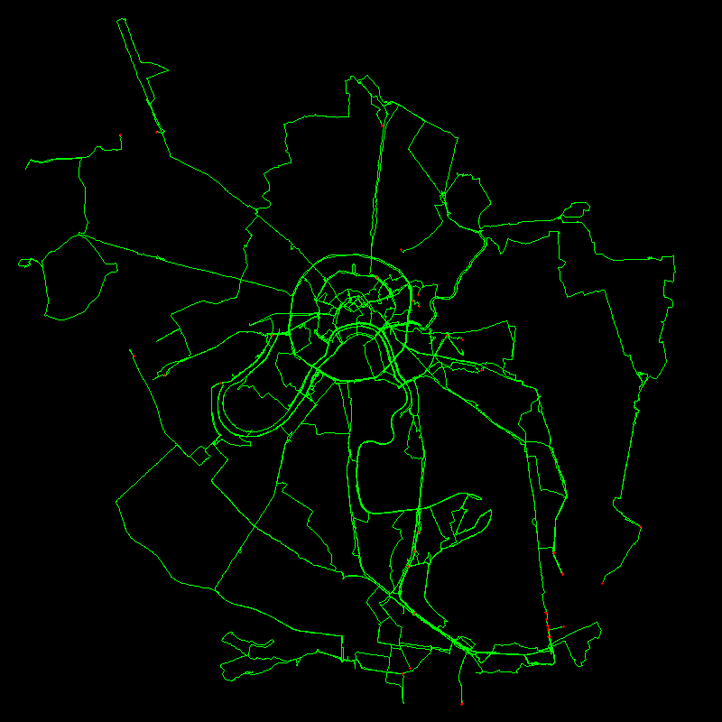

# gps-track-visualizer

This script converts GPS tracks in GPX format to a PNG image.

```
usage: gps-track-visualizer.py [-h] [--width WIDTH] [--height HEIGHT]
                               [--border BORDER]
                               track_list out_image

positional arguments:
  track_list       list of GPX tracks or directories with tracks
  out_image        output PNG image

optional arguments:
  -h, --help       show this help message and exit
  --width WIDTH    width of the output image
  --height HEIGHT  height of the output image
  --border BORDER  border on the output image
```

## Example:
```
$ ./gps-track-visualizer.py example/list.txt example/out.png --width 800 --height 800

Processing ./example/2010/2010-08-18.gpx [43.42 km]
Processing ./example/2010/2010-10-10.gpx [78.46 km]
Processing ./example/2011/2011-03-27.gpx [47.99 km]
Processing ./example/2011/2011-04-02.gpx [35.11 km]
Processing ./example/2011/2011-04-16.gpx [51.32 km]
Processing ./example/2011/2011-04-30.gpx [50.79 km]
Processing ./example/2011/2011-05-09.gpx [67.87 km]
Processing ./example/2011/2011-10-01.gpx [27.35 km]
Processing ./example/2011/2011-10-08.gpx [84.69 km]
Processing ./example/2012/2012-03-31.gpx [32.08 km]
Processing ./example/2012/2012-04-30.gpx [54.81 km]
Processing ./example/2012/2012-05-13.gpx [42.70 km]
Processing ./example/2012/2012-09-22.gpx [78.76 km]
Processing ./example/2012/2012-10-14.gpx [75.85 km]
Processing ./example/2012/2012-10-20.gpx [70.90 km]
Processing ./example/2013/2013-04-13.gpx [44.35 km]
Processing ./example/2013/2013-05-03.gpx [60.29 km]
Processing ./example/2013/2013-05-09.gpx [57.34 km]
Processing ./example/2014/2014-04-05.gpx [57.43 km]
Processing ./example/2014/2014-10-04.gpx [76.30 km]
Total: 1137.83 km

Converting coordinates...
Creating image...
```


